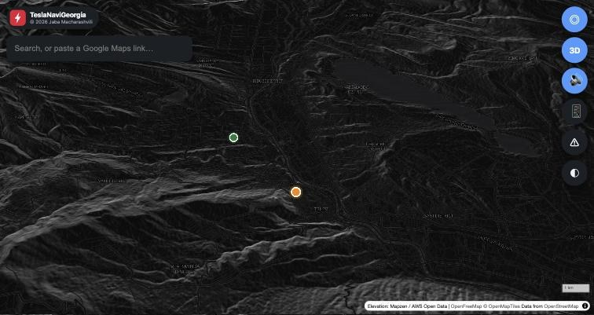
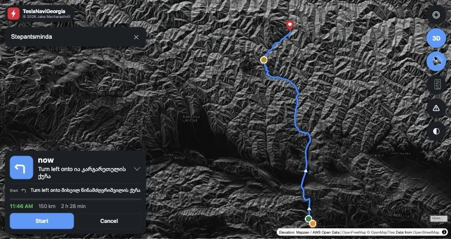
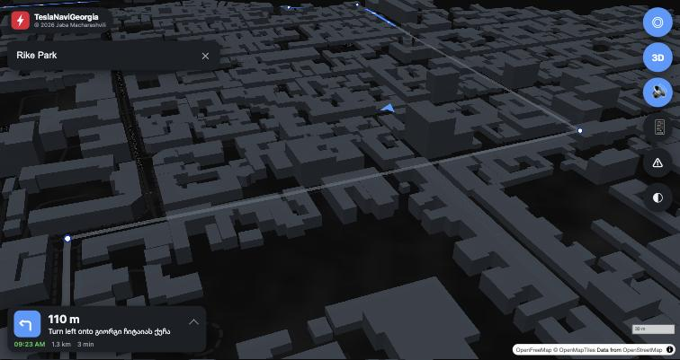
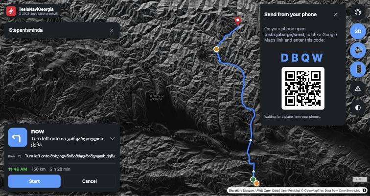
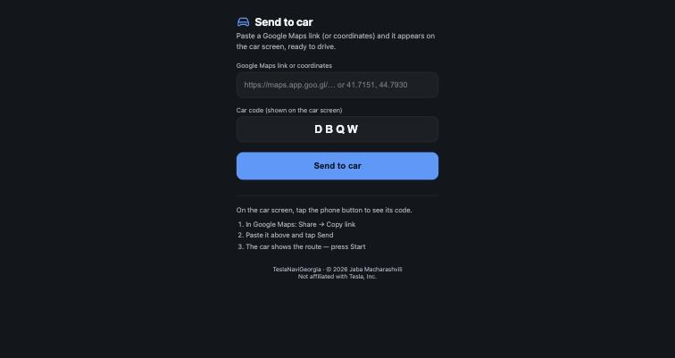

# TeslaNaviGeorgia

A big-screen map and navigation app for driving in Georgia 🇬🇪, built to run in a car's
built-in web browser and on phones. Tesla's own navigation has limited routing here, so
this fills the gap with search, turn-by-turn directions, 3D terrain for the mountain
roads, and destinations sent straight from a phone.

Live at **[tesla.jaba.ge](https://tesla.jaba.ge)**, phone page at **[tesla.jaba.ge/send](https://tesla.jaba.ge/send)**

© 2026 Jaba Macharashvili. A personal project.
Not affiliated with or endorsed by Tesla, Inc.



## What it does

| | |
| --- | --- |
| **Search** | Places across Georgia, or paste a Google Maps link or coordinates |
| **Navigation** | Turn-by-turn with spoken directions, live ETA, automatic re-routing |
| **Other ways** | Up to three routes side by side before you start; pick one with a tap |
| **Speed** | The signed speed limit while you drive, and a warning with a chime before a speed camera |
| **3D** | Real terrain and 3D buildings; the camera tilts and turns as you drive |
| **Send from phone** | Share a place from Google Maps on your phone and it appears in the car |
| **Road updates** | Closures, road works, hazards and chargers you publish yourself |
| **Old and new cars** | Detects the screen and loads a lighter version on older ones |

## Using it in the car

Open **tesla.jaba.ge** in the car browser and allow location access.

### 1. Pick a destination

Type a place in the search box, tap anywhere on the map, or send one from your phone.
A tap on the map names what is there, a place or an address, with a **Drive here** button.
You get the whole route first, with distance and arrival time. When there are other ways
there, they show in grey with their times, and as buttons under the route: tap one to take it.



### 2. Press Start

The camera swoops down into the driving view. The panel shrinks to a single bar showing
the next turn. Tap it any time to see the trip details, the step list and the End button.

Under the search box, a sign shows the speed limit wherever OpenStreetMap has it; it turns
red when you are more than 5 km/h over. About 400 m before a speed camera (more at
motorway speeds) a warning shows the camera's limit and the distance, with a short chime
when voice is on. It also works without a route, for a camera on the road straight ahead.



### 3. Sending a place from Google Maps

Tap the 📱 button in the car. It shows a 4-letter code and a QR code.



On your phone:

1. In Google Maps, open the place → **Share** → **Copy link**
2. Scan the QR code, or open **tesla.jaba.ge/send**
3. Paste the link, type the car's code, tap **Send to car**



The car picks it up within a few seconds and shows the route, ready for Start. Your phone
remembers the code, so next time you only paste and send. Apple Maps and Waze links work
too, as do plain coordinates like `41.7151, 44.7930`.

### Buttons on the right

| | |
| --- | --- |
| ◎ | Follow my location (turns off when you drag the map) |
| 3D | 3D view on/off |
| 🔊 | Voice directions on/off |
| 📱 | Show the code for sending places from a phone |
| ⚠ | Road updates |
| ◐ | Day / night map |

## Publishing road updates

Edit `public/updates.json`, commit and push, and it goes live a minute later. Each item:

```json
{
  "id": "unique-id",
  "type": "closure | works | hazard | charger | info",
  "title": "Jvari Pass closed",
  "description": "Snow, closed until morning",
  "lat": 42.5096, "lon": 44.4637,
  "source": "Where the info came from",
  "updated": "2026-09-23"
}
```

The list ships empty. Add an entry and it shows on the map and in the ⚠ panel.

## How it is built

| Part | Service |
| --- | --- |
| Hosting | Cloudflare Workers (static site + API), auto-deployed from `main` |
| Map | [MapLibre GL JS](https://maplibre.org) with [OpenFreeMap](https://openfreemap.org) tiles (OpenStreetMap data) |
| Routing | [OSRM](https://project-osrm.org) public server, with alternatives, via `/api/route` |
| Speed limits | OpenStreetMap limits, matched to the route by [Valhalla](https://valhalla.github.io/valhalla/) on FOSSGIS's public server, via `/api/limits` |
| Speed cameras | OpenStreetMap, via [Overpass](https://overpass-api.de); `/api/cameras` answers from a copy renewed daily, or the one in `public/cameras.json` |
| Search | [Photon](https://photon.komoot.io), limited to Georgia, via `/api/search`; what is at a tapped spot via `/api/reverse` |
| 3D terrain | Mapzen elevation tiles on AWS Open Data, via `/api/dem` |
| Phone → car | Cloudflare D1, via `/api/send` and `/api/inbox` |

```
public/     index.html, app.js (map + navigation), nav.js (route maths, arrows),
            boot.js (picks the map engine), send.html (phone page), check.html,
            style.css, updates.json, cameras.json, sw.js (offline copy)
src/        worker.js, the API and the link resolver; cameras.mjs, the camera query
scripts/    cameras.mjs, refreshes public/cameras.json (npm run cameras)
docs/       screenshots for this file
```

Shared map links are resolved server-side (`/api/resolve`) because short links have to be
followed. Only Google, Apple and Waze hosts are allowed. Links shared from the Google Maps
phone app name the place instead of giving coordinates; those are looked up on Google's
embed page.

## Old car screens

A 2018 Model 3 has no WebGL 2, which the current map engine needs, so `boot.js` checks the
browser and loads an older engine plus a lighter mode with no terrain, no 3D buildings and
a slower camera. Everything else works the same. If a car still cannot start the map, it
says so on screen, and **tesla.jaba.ge/check.html** lists what that browser supports.

## Running it yourself

```bash
npm install
npm run dev        # http://localhost:8787
npm run deploy     # or just push to main
npm run cameras    # refresh the speed camera list shipped with the site
```

Handy while developing:

- `?sim=1` with a destination drives the route by itself: `/?to=44.8010,41.7250&name=Rike%20Park&sim=1`
- `?miss=1` alongside `sim=1` drives straight past the first turn, to test re-routing
- `?debug=1` shows GPS accuracy, distance off the route line and the re-route counters
- `?gl1` forces the old-screen version on any browser
- `?slow=1` pretends the connection is slow: the app starts without 3D relief and hill shading
- `window.geodrive` in the console exposes the map and state
